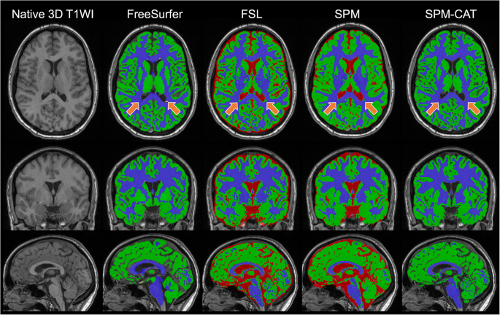

|PythonVersion|_ |Coveralls|_ |Travis|_ |PyPi|_ |Doc|_ |Docker|_

.. |PythonVersion| image:: https://img.shields.io/badge/python-3.6%20%7C%203.7%20%7C%203.8-blue
.. _PythonVersion: https://img.shields.io/badge/python-3.6%20%7C%203.7%20%7C%203.8-blue

.. |Coveralls| image:: https://coveralls.io/repos/neurospin-deepinsight/brainprep/badge.svg?branch=master&service=github
.. _Coveralls: https://coveralls.io/github/neurospin/brainprep

.. |Travis| image:: https://travis-ci.com/neurospin-deepinsight/brainprep.svg?branch=master
.. _Travis: https://travis-ci.com/neurospin/brainprep

.. |PyPi| image:: https://badge.fury.io/py/brainprep.svg
.. _PyPi: https://badge.fury.io/py/brainprep

.. |Doc| image:: https://readthedocs.org/projects/brainprep/badge/?version=latest
.. _Doc: https://brainprep.readthedocs.io/en/latest/?badge=latest

.. |Docker| image:: https://img.shields.io/docker/pulls/neurospin/brainprep
.. _Docker: https://hub.docker.com/r/neurospin/brainprep

brainprep: tools for brain MRI Deep Learning pre-processing
===========================================================

\:+1: If you are using the code please add a star to the repository :+1:

`brainprep` is a toolbox that provides common Deep Learning brain
MRI pre-processing scripts as well as Quality Control (QC) routines:

* brainprep --help
* brainprep cat12vbm --help
* brainprep cat12vbmqc --help
* brainprep fsreconall --help
* brainprep fsreconallqc --help
* brainprep quasiraw --help
* brainprep quasirawqc --help

The general idea is to provide containers to execute these scripts in order to
enforce reproducible research.

This work is made available by a `community of people
<https://github.com/neurospin-deepinsight/brainprep/blob/master/AUTHORS.rst>`_,
amoung which the CEA Neurospin BAOBAB laboratory.

    
Important links
===============

- `Official source code repo <https://github.com/neurospin-deepinsight/brainprep>`_
- HTML stable documentation: WIP
- `HTML documentation <https://brainprep.readthedocs.io/en/latest>`_
- `Release notes <https://github.com/neurospin-deepinsight/brainprep/blob/master/CHANGELOG.rst>`_

Where to start
==============

Examples are available in the
`gallery <https://brainprep.readthedocs.io/en/latest/auto_gallery/index.html>`_.
The module is described in the
`API documentation <https://brainprep.readthedocs.io/en/latest/generated/brainprep.html>`_.
All scripts are documentated in the `Scripts documentation <https://brainprep.readthedocs.io/en/latest/generated/brainprep.workflow.html>`_.

Install
=======

Complete instructions are available `here
<https://brainprep.readthedocs.io/en/latest/generated/installation.html>`_.

License
=======

This project is under the following
`LICENSE <https://github.com/neurospin-deepinsight/brainprep/blob/master/LICENSE.rst>`_.

