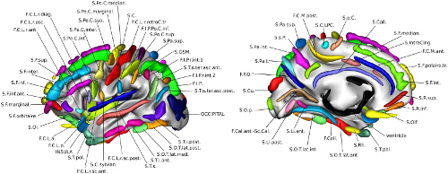

.. _sulcirec:

Sulci Identification Workflow
=============================

Introduction
------------

Preprocessing MRI data is a crucial step in transforming raw scanner outputs
into signals that can be meaningfully interpreted and compared across
individuals. This task is especially complex when studying the human brain
folding patterns. Every person's folding pattern is unique, like a fingerprint.
The primary challenge is that these folds (sulci) change shape, split, or
merge drastically from one person to another. Successfully mapping these
folds is of scientific and clinical interest; by precisely measuring their
depth and width, doctors can spot early brain shrinking in diseases like
Alzheimer's. Furthermore, accurate sulcal mapping helps scientists understand
how the brain develops.

Requirements
------------

+------------+--------------+
| CPU        | RAM          |
+============+==============+
| 1          | 1 GB         |
+------------+--------------+

Description
-----------

**Processing Steps**

This analysis relies on morphologist's pipeline
:footcite:p:`fischer2012morphologist`. 

- **Automate High‑Quality Brain Segmentation**
  The preprocessing performs full anatomical segmentation of T1 MRI data,
  including gray matter, white matter, and cerebrospinal fluid. This
  provides the foundation for downstream morphometric analyses.

- **Extract and Analyze Cortical Surfaces**
  The tool reconstructs cortical surfaces and generates meshes.

- **Perform Detailed Sulcal Morphometry**
  The sulcal analysis, includes sulcus recognition (now CNN‑based),
  sulcal depth, length, and span, gyrification index, and cortical fold graph
  construction. 
 
**Quality Control**:

- **Sulcal Morphometry scores**
  Images were classified as motion outliers when they exceeded established
  thresholds for these metrics. Specifically, any volume with
  a mean framewise displacement greater than 0.2 mm, or with a mean
  standardized DVARS value exceeding 1.5, was flagged as low‑quality.

- **Manual inspection**  
  Subject‑level quality‑control HTML reports are reviewed manually to ensure
  that preprocessing outcomes are consistent across participants and that no
  systematic artifacts remain.

Outputs
-------

The ``sulcirec`` directory contains subject-level results, logs, and
quality-control outputs.
The structure is organized following the :ref:`brainprep ontology <ontology>`.

.. code-block:: text

    sulcirec/
    ├── dataset_description.json
    └── subjects
        └── sub-01
            └── ses-00
                ├── log
                │   └── report_20260409_112204.rst
                └── run-28236
                    ├── anat
                    │   ├── folds
                    │   │   └── 3.1
                    │   │       ├── sub-01_ses-00_run-28236_hemi-L.arg
                    │   │       ├── sub-01_ses-00_run-28236_hemi-L.data
                    │   │       │   ├── aims_Tmtktri.gii
                    │   │       │   ├── bottom_Bucket.bck
                    │   │       │   ├── cortical_Bucket.bck
                    │   │       │   ├── junction_Bucket.bck
                    │   │       │   ├── other_Bucket.bck
                    │   │       │   ├── plidepassage_Bucket.bck
                    │   │       │   └── ss_Bucket.bck
                    │   │       ├── sub-01_ses-00_run-28236_hemi-L_sulcivoronoi.nii.gz
                    │   │       ├── sub-01_ses-00_run-28236_hemi-R.arg
                    │   │       ├── sub-01_ses-00_run-28236_hemi-R.data
                    │   │       │   ├── aims_Tmtktri.gii
                    │   │       │   ├── bottom_Bucket.bck
                    │   │       │   ├── cortical_Bucket.bck
                    │   │       │   ├── junction_Bucket.bck
                    │   │       │   ├── other_Bucket.bck
                    │   │       │   ├── plidepassage_Bucket.bck
                    │   │       │   └── ss_Bucket.bck
                    │   │       ├── sub-01_ses-00_run-28236_hemi-R_sulcivoronoi.nii.gz
                    │   │       └── sul-0_auto
                    │   │           ├── sub-01_ses-00_run-28236_sul-0_auto_sulcal_morphometry.csv
                    │   │           ├── sub-01_ses-00_run-28236_sul-0_hemi-L_auto.arg
                    │   │           ├── sub-01_ses-00_run-28236_sul-0_hemi-L_auto.data
                    │   │           │   ├── aims_Tmtktri.gii
                    │   │           │   ├── bottom_Bucket.bck
                    │   │           │   ├── cortical_Bucket.bck
                    │   │           │   ├── junction_Bucket.bck
                    │   │           │   ├── other_Bucket.bck
                    │   │           │   ├── plidepassage_Bucket.bck
                    │   │           │   ├── ss_Bucket.bck
                    │   │           ├── sub-01_ses-00_run-28236_sul-0_hemi-R_auto.arg
                    │   │           └── sub-01_ses-00_run-28236_sul-0_hemi-R_auto.data
                    │   │               ├── aims_Tmtktri.gii
                    │   │               ├── bottom_Bucket.bck
                    │   │               ├── cortical_Bucket.bck
                    │   │               ├── junction_Bucket.bck
                    │   │               ├── other_Bucket.bck
                    │   │               ├── plidepassage_Bucket.bck
                    │   │               └── ss_Bucket.bck
                    │   ├── mesh
                    │   │   ├── sub-01_ses-00_run-28236_head.surf.gii
                    │   │   ├── sub-01_ses-00_run-28236_hemi-L_pial.surf.gii
                    │   │   ├── sub-01_ses-00_run-28236_hemi-L_white.surf.gii
                    │   │   ├── sub-01_ses-00_run-28236_hemi-R_pial.surf.gii
                    │   │   └── sub-01_ses-00_run-28236_hemi-R_white.surf.gii
                    │   ├── segmentation
                    │   │   ├── sub-01_ses-00_run-28236_brain.nii.gz
                    │   │   ├── sub-01_ses-00_run-28236_edges.nii.gz
                    │   │   ├── sub-01_ses-00_run-28236_hemi-L_cortex.nii.gz
                    │   │   ├── sub-01_ses-00_run-28236_hemi-L_csf.nii.gz
                    │   │   ├── sub-01_ses-00_run-28236_hemi-L_grey_white.nii.gz
                    │   │   ├── sub-01_ses-00_run-28236_hemi-L_gw_interface.nii.gz
                    │   │   ├── sub-01_ses-00_run-28236_hemi-L_roots.nii.gz
                    │   │   ├── sub-01_ses-00_run-28236_hemi-L_skeleton.nii.gz
                    │   │   ├── sub-01_ses-00_run-28236_hemi-R_cortex.nii.gz
                    │   │   ├── sub-01_ses-00_run-28236_hemi-R_csf.nii.gz
                    │   │   ├── sub-01_ses-00_run-28236_hemi-R_grey_white.nii.gz
                    │   │   ├── sub-01_ses-00_run-28236_hemi-R_gw_interface.nii.gz
                    │   │   ├── sub-01_ses-00_run-28236_hemi-R_roots.nii.gz
                    │   │   ├── sub-01_ses-00_run-28236_hemi-R_skeleton.nii.gz
                    │   │   ├── sub-01_ses-00_run-28236_hfiltered.nii.gz
                    │   │   ├── sub-01_ses-00_run-28236_nobias.han
                    │   │   ├── sub-01_ses-00_run-28236_nobias.his
                    │   │   ├── sub-01_ses-00_run-28236_nobias.nii.gz
                    │   │   ├── sub-01_ses-00_run-28236_skull_stripped.nii.gz
                    │   │   ├── sub-01_ses-00_run-28236_sul-0_brain_volumes.csv
                    │   │   ├── sub-01_ses-00_run-28236_variance.nii.gz
                    │   │   ├── sub-01_ses-00_run-28236_voronoi.nii.gz
                    │   │   └── sub-01_ses-00_run-28236_whiteridge.nii.gz
                    │   ├── sub-01_ses-00_run-28236_sul-0_morphologist_report.json
                    │   ├── sub-01_ses-00_run-28236_sul-0_morphologist_report.pdf
                    ├── qc.tsv
                    ├── registration
                    │   ├── sub-01_ses-00_run-28236_T1w.referential
                    │   ├── sub-01_ses-00_run-28236_T1w_TO_MNI152.trm
                    │   └── sub-01_ses-00_run-28236_T1w_TO_Talairach-ACPC.trm
                    ├── sub-01_ses-00_run-28236.APC
                    ├── sub-01_ses-00_run-28236_desc-conform_T1w.nii.gz
                    ├── sub-01_ses-00_run-28236_normalized_SPM.nii
                    ├── sub-01_ses-00_run-28236_sn.mat
                    └── sub-01_ses-00_run-28236_sn_pass1.mat

**Description of contents**:

- ``dataset_description.json``  
  Metadata describing the process, including versioning and processing
  information.
- ``log/report_<timestamp>.rst``  
  Contains group-level workflow steps and parameters.
- ``quality_check/motion_confounds.tsv``  
  Table containing the mean standardized DVARS and mean FD for each
  subject/session/run. The table includes a binary ``qc`` column indicating
  the quality control result.
- ``subjects/sub-<id>/ses-<id>/logs/report_<timestamp>.rst``  
  Contains subject-level workflow steps and parameters.
- ``subjects/sub-<id>/ses-<id>/run-<id>``  
  Standard morphologist folder structure (https://brainvisa.info/axon-6.0/en/processes/categories/morphologist/category_documentation.html).

Featured examples
-----------------

.. grid::

  .. grid-item-card::
    :link: ../auto_examples/workflows/plot_sulcirec.html
    :link-type: url
    :columns: 12 12 12 12
    :class-card: sd-shadow-sm
    :margin: 2 2 auto auto

    .. grid::
      :gutter: 3
      :margin: 0
      :padding: 0

      .. grid-item::
        :columns: 12 4 4 4

        .. image:: ../auto_examples/workflows/images/thumb/sphx_glr_plot_sulcirec_thumb.png

      .. grid-item::
        :columns: 12 8 8 8

        .. div:: sd-font-weight-bold

          Sulci reconstruction Pre-Processing

        Explore how to perform this analysis.

References
----------

.. footbibliography::
